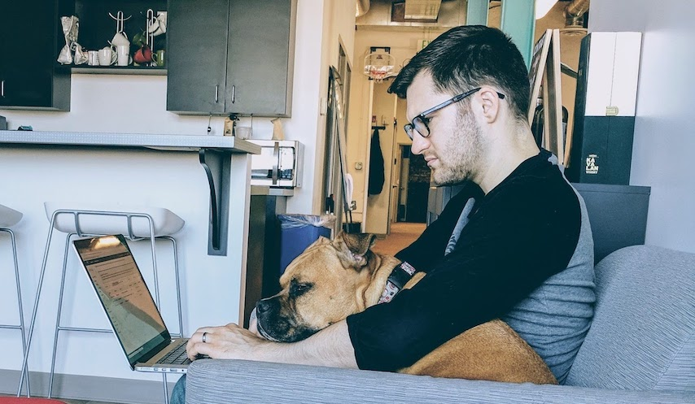

👨🏻‍💻Hey, I'm Johnathan

🐶 My canine pair programmer is Shelby

🏭 Principal Engineer at Contrast Security developing a Java agent that builds security into applications

☕️ Interested in building high-performance Java systems

📚 Learning a lot about integration testing at scale and infosec

🤓 Sharing my side-projects and tinkerings on GitHub

📝 Blogging at [johnathangilday.com/blog](https://johnathangilday.com/blog)

😎 More about me and my software development career at [johnathangilday.com](https://johnathangilday.com)